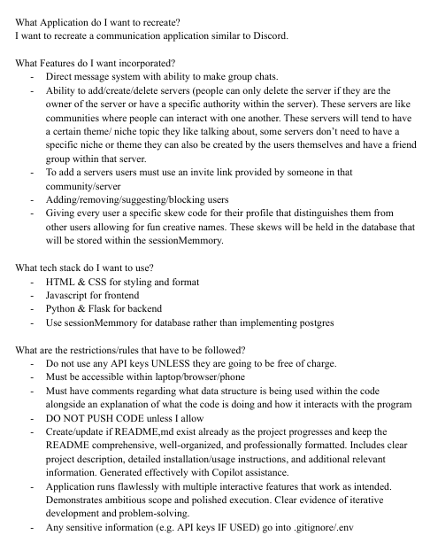
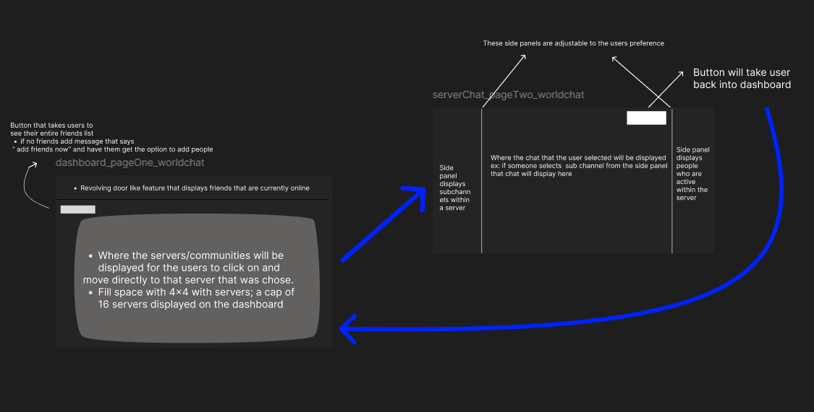
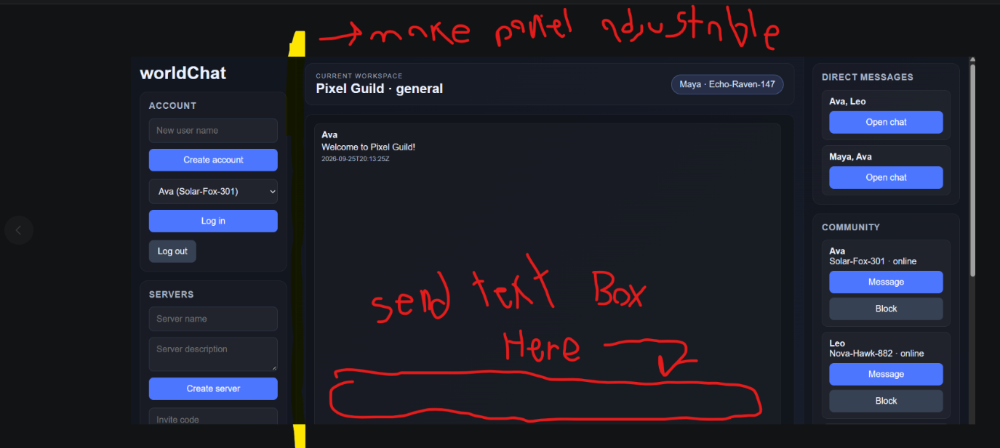

This 'REFLECTION.md' is being used to answer reflective questions regarding this session

## What did you ask Copilot to help you build? How did you break down the problem?
In inspiration of discord, this program was designed to connect users through communities built upon a wide range of topics with the goal of connecting everyone in a shared space where people can get to know one another. 

## How did your approach to asking questions change as you worked?

## What parts of the development process with GitHub Copilot surprised you?
What surprised me the most during the development process with GitHub Copilot is that no matter how specific you are with the restrictions/steps you want the AI to take to generate the product of the prompt, there will always be some type of error that would require human critical-thinking. I frequently found myself sitting down and rewriting certain pieces of code alongside organizing my codespace as production went on. 

## What did you learn about the technology you used that you didn't know before?
I learned that AI isn't the answer to everything in the technology realm. AI constantly makes mistakes which sometimes takes professional knowledge to fix. However, this doesn't change my stance on AI being useless. During the production of this program I saved hours and possibly days of coding because of the AI which I am really happy about.

## What would you do differently if you had to build this again?
What I would do differently would be take more time with the wireframe and the reference sheets I had created to help the AI generate what I wanted. The context I had given AI had felt rushed which is why I think I ran into multiple issues in the middle of production. 
